# E-Commerce Microservice Platform

[](https://golang.org/)
[](https://opensource.org/licenses/MIT)
[](https://docs.docker.com/compose/)

An event-driven, fully observable e-commerce microservice platform simulation, designed to tackle the core engineering challenges of large-scale systems.

## 📖 Overview

This project is designed to solve the fundamental engineering challenges faced by large-scale e-commerce platforms, such as distributed data consistency, service independence, performance, and observability. The system manages the core user flow from registration and adding items to a cart to placing an order through microservices, each with its own distinct responsibility and database.

At the heart of the project lie the **Saga Pattern** and an **Event-Driven Architecture**, which reliably manage transactions across services in an asynchronous manner.

## 🚀 Architecture

The system consists of 5 main microservices, each with a single responsibility, designed to be independently developed and deployed. These services are supported by a robust infrastructure stack. The entire platform can be launched with a single `docker-compose up` command.

### System Architecture

```mermaid
graph TD
    subgraph User Layer
        U[👤 User]
    end

    subgraph API Layer
        GW[🌐 API Gateway]
    end

    subgraph Microservice Layer
        US[🧑‍💼 User Service]
        PS[📦 Product Service]
        CS[🛒 Cart Service]
        OS[📬 Order Service]
    end

    subgraph Data Layer
        PG[(🗄️ PostgreSQL)]
        CB[(🧩 Couchbase)]
        RD[(⚡ Redis)]
    end

    subgraph Messaging & Events
        RMQ[(📨 RabbitMQ)]
    end

    subgraph Observability Layer
        PROM[(📊 Prometheus)]
        GRAF[(📈 Grafana)]
        JAEGER[(🔍 Jaeger)]
        EFK[(📝 EFK Stack)]
    end

    U -- HTTP/REST --> GW

    GW -- gRPC --> US
    GW -- gRPC --> PS
    GW -- gRPC --> CS
    GW -- gRPC --> OS

    US -- CRUD --> PG
    PS -- CRUD --> PG
    PS -- Cache --> RD
    CS -- CRUD --> CB
    OS -- CRUD --> PG

    OS -- Publishes Events --> RMQ
    PS -- Subscribes & Publishes --> RMQ
    CS -- Subscribes --> RMQ

    GW -- Metrics --> PROM
    US -- Metrics --> PROM
    PS -- Metrics --> PROM
    CS -- Metrics --> PROM
    OS -- Metrics --> PROM

    PROM -- Data Source --> GRAF

    GW -- Traces --> JAEGER
    US -- Traces --> JAEGER
    PS -- Traces --> JAEGER
    CS -- Traces --> JAEGER
    OS -- Traces --> JAEGER

    GW -- Logs --> EFK
    US -- Logs --> EFK
    PS -- Logs --> EFK
    CS -- Logs --> EFK
    OS -- Logs --> EFK
```



### Core Architectural Patterns

*   **Saga Pattern:** Manages distributed transactions that involve multiple services (like a `checkout` process) through a sequence of local transactions, where each service publishes an event upon completion. This ensures "eventual consistency" across the system.
*   **Polyglot Persistence:** The most suitable database technology is chosen for each workload: **PostgreSQL** for structured data, **Couchbase** for flexible cart data, and **Redis** for high-speed caching.
*   **Full-Stack Observability:** The system is fully integrated with the three pillars of modern observability: **Traces** (Jaeger), **Metrics** (Prometheus/Grafana), and **Logs** (EFK Stack).

## 🛠️ Tech Stack

| Category | Technology |
| :--- | :--- |
| **Language** | Go |
| **API Gateway** | Fiber |
| **Communication** | gRPC (Synchronous), RabbitMQ (Asynchronous) |
| **Data Format** | Protobuf |
| **Databases** | PostgreSQL, Couchbase |
| **Cache** | Redis |
| **Logging** | Zap (Structured), EFK Stack (Elasticsearch, Fluent Bit, Kibana) |
| **Observability** | OpenTelemetry, Jaeger (Tracing), Prometheus (Metrics), Grafana (Dashboards) |
| **Containerization** | Docker, Docker Compose |

## ⚙️ Setup & Running

This repository contains the central configuration files to launch the entire project's infrastructure and Go services with a single command.

### Prerequisites

*   [Docker](https://www.docker.com/get-started)
*   [Docker Compose](https://docs.docker.com/compose/install/)
*   [Go (v1.22+)](https://golang.org/doc/install)
*   All microservice repositories must be cloned at the same directory level as this repository.

    ```
    /e-commerce-project
    |-- /api-gateway
    |-- /service-user
    |-- /service-product
    |-- /service-cart
    |-- /service-order
    |-- /proto-definitions
    |-- /docker-compose-environment  <-- (You are here)
    ```

### Running the Platform

1.  Navigate to the `docker-compose-environment` directory in your terminal.
2.  Run the following command to build and start the entire system in the background:
    ```bash
    docker-compose up -d --build
    ```
3.  To stop the system:
    ```bash
    docker-compose down
    ```
4.  To stop the system and remove all data volumes (databases, logs, etc.):
    ```bash
    docker-compose down -v
    ```

## 📡 API Endpoints

The main API endpoints are served by the `api-gateway` service. For a detailed list, please refer to the `README.md` file in the `api-gateway` repository. Some core endpoints include:

*   **User:** `POST /api/v1/register`, `POST /api/v1/login`
*   **Product:** `GET /api/v1/products/:id`
*   **Cart:** `GET /api/v1/cart`, `POST /api/v1/cart/items`
*   **Order:** `POST /api/v1/checkout`

## 🔭 Observability

Once the system is running, you can monitor the platform's status through the following interfaces:

*   **Jaeger (Traces):** [http://localhost:16686](http://localhost:16686)
*   **Prometheus (Metrics):** [http://localhost:9090](http://localhost:9090)
*   **Grafana (Dashboards):** [http://localhost:3001](http://localhost:3001)
    *   After adding Prometheus as a data source, you can import the dashboard with ID **14331**.
*   **Kibana (Logs):** [http://localhost:5601](http://localhost:5601)
    *   You can discover all logs by creating a "data view" with the index `ecommerce-logs-*`.

